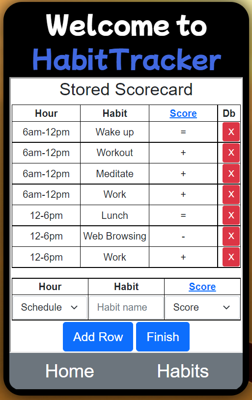

# django-habits
A Django application that helps the user to track habits and to increase its awareness about each habit.

# Django and Its batteries included 
Django is a Python web application framework, that has the philosophy of "batteries-included", meaning that comes with compatibility to multiple tools and is very user-friendly. It was way easier to organize static and dynamic files with Model-View-Template(MVT) architecture provided by Django framework. It was also handy that Django supports up to four databases. 

Example of How simple Models can be:
```
class HabitTracker(models.Model):
    user_id = models.ForeignKey(User, on_delete = models.CASCADE)
    habit_id = models.ForeignKey(Habit, on_delete = models.CASCADE)
    actual_date = models.DateTimeField(auto_now_add=True)
    duration = models.PositiveIntegerField()
```
## Protection against Security Loopholes
In all forms required for this application I used the protections given by the framework to protect users against attacks like XSS and CSRF, SQL injections and so on.

Add this line to your html-forms to protect your code also:
```

```
## ORM , Models and decorators
Django's Object Relational Mapper(ORM) makes SQL queries look much more inteligible.
```
@login_required
def allhabits(request):
    habitlist = models.Habit.objects.filter(user_id=request.user)
``` 

# Bootstrap Framework
I used the Bootstrap Framework because of its simplicity to make web applications Mobile friendly. I even played with it to make page content look like an Android App.


# Postgres-Sql
I chose to use Postgres over the default sqllite because of its advanced features and robust multiplatform support of pgAdmin. Also because if I wanted to upload this application to Heroku one day, it has support to Postgres but not to sqlite.  

# Results

The result application allows the user to signup, login, create a habit and log a habit. Allows you also to create a Scorecard of your daily habits, concept from Atomic Habits book, which can bring more awareness on where you are spending your time. 

Pages side by side: First page,Page for creating a habit,Page for logging a habit,Scorecard page;

<p float="left">
  
   
  
  
</p>